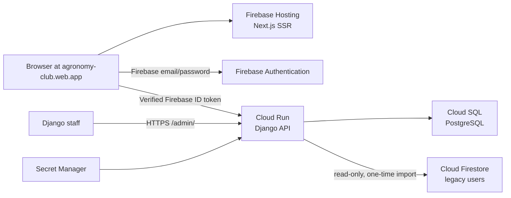

# Production Firebase member migration and web.app release

## Purpose

Release the new Agronomy Club application to `https://agronomy-club.web.app` while retaining the existing Firebase Authentication identities and the six genuine member profiles currently stored in the project's legacy Firestore database. The new Django application will own the imported member profiles and all future chapter, event, resource, quiz, and membership data.

This release is deliberately limited to real legacy data. The Firestore inventory found six documents in `users`, no Firestore chapters, quizzes, or quiz subcollections, and no other member content to transfer. The example chapters and fixtures in either repository are not production data and will not be loaded.

## Decisions

- Keep Firebase Authentication as the identity provider in the existing `agronomy-club` Firebase project. Existing members retain their passwords and Firebase UIDs.
- Create an isolated production Cloud Run API and Cloud SQL PostgreSQL database in `asia-southeast1`. The staging API and database remain independent.
- Use the existing Firebase Hosting site `agronomy-club` to serve the new Next.js application at `https://agronomy-club.web.app`.
- Point the production browser build at the canonical Cloud Run API URL. This avoids an untested Hosting-to-API proxy and does not require DNS changes for `api.agronomyclub.org`.
- Import only `users/{uid}` Firestore documents. The import derives the email from Firebase Authentication and does not trust the legacy `verified` field.
- Imported profiles preserve the authenticated UID, email, full name, and a safe role mapping. They have no graduation year or discipline until the member supplies those fields after verified sign-in.
- Do not import absent chapters, generated fixtures, or sample media. Administrators create genuine chapters and content through the improved Django Admin interface after release.

## Target architecture

Firebase Hosting creates the server-rendered Next.js frontend. Cloud Run exposes the Django API and Admin over its generated HTTPS address. The browser's JavaScript sends a Firebase ID token to the Django member-profile endpoint. Cloud Run verifies the token using Application Default Credentials and accesses PostgreSQL through the Cloud SQL Unix socket. Secret Manager supplies the Django secret and database password only to the production service account.

## Member data contract

The Firestore importer reads each `users/{uid}` document and obtains the authoritative Firebase Authentication user for the same UID. It creates a Django `User` only when all of these checks pass:

1. The Firestore document ID is a non-empty string UID.
2. Firebase Authentication returns an account for that UID with a non-empty email.
3. If Firestore contains an email, its normalized value equals the Firebase Authentication email.
4. The Firestore `fullName` is a non-empty string after trimming.
5. No Django profile already owns the UID or email.

The import maps legacy roles as follows: `member`, `curator`, and `chapter_lead` become Django `user`; `admin` becomes Django `admin`; `alumni` becomes Django `alumni`. Unknown roles are skipped and counted. It never uses Firestore's `verified` field, because live Firebase Authentication token verification remains the authority for email verification.

Existing Firebase members will have a profile but will need to supply graduation year and discipline. The API allows these two fields to be null or blank only for imported records. Its write validation requires a complete profile on creation and requires an incomplete record to be made complete before an update is accepted. The member page recognises incomplete profiles, pre-fills the imported name, and uses `PATCH` to save the missing fields. It never gives the browser a way to select a role, Firebase UID, or email.

The importer is idempotent and conservative:

- Its default mode is a dry run and writes no records.
- `--apply` is required to create records.
- Re-running after a successful import reports existing profiles and does not overwrite them.
- It logs aggregate counts only: scanned, candidates, created, existing, skipped-invalid, skipped-conflict, and skipped-unknown-role. It does not log names, email addresses, UIDs, tokens, or document values.
- The production Cloud Run Job receives Firestore access through its runtime service account. No service-account JSON is copied, downloaded, or committed.

## Deployment sequence

1. Implement and test nullable imported-profile support and the one-time importer locally.
2. Build the production Django image with Cloud Build, create the production database, secrets, runtime service account, Cloud Run service, and migration job. Use the isolated production names `agronomy-club-api-prod`, `agronomy-club-postgres-prod`, `agronomy-club-migrate-prod`, and `agronomy-club-import-firestore-members-prod`.
3. Deploy the API, run database migrations, and call `/api/healthcheck/ping/` and `/admin/` over HTTPS.
4. Execute the import job once without `--apply`; compare its aggregate candidate count with the recorded Firestore user count of six. Execute it with `--apply` only when the dry-run count is six and no conflict or invalid records are reported. Re-run dry-run mode to establish that all six are existing profiles.
5. Build a Firebase Hosting preview channel from `client/`, with a temporary ignored `.env.production` containing only public Firebase identifiers and the production API URL. Test public routes, the production API's exact live-origin CORS header, and Django Admin before promotion. The preview hostname is not an allowed production API origin, so authenticated member testing takes place on the live domain after promotion.
6. Deploy the same tested commit to Firebase Hosting live, then test an existing verified member's profile-completion flow. Record the prior live Hosting version `3c44a8ab43b9413c`, the new Hosting version, Cloud Run revision, API image digest, migration version, and importer aggregate counts in the release record.

## Security and operational controls

- The production Cloud Run runtime service account has only Cloud SQL Client, Secret Manager Secret Accessor for its two secrets, Firebase token-verification access through ADC, and Firestore read access for the one-off importer job. It has no editor or owner role.
- Cloud SQL stays reachable from Cloud Run through its Unix socket. Django production settings restrict allowed hosts and CORS to the exact production frontend origin and enforce proxy HTTPS, secure cookies, and HSTS.
- The deployer creates unique production secrets with `gcloud secrets`; secret values are never echoed to terminal output, source files, Git history, Cloud Build substitutions, or Firebase environment files.
- Firebase Hosting preview is tested before production traffic changes. The existing live Hosting release is left available for a direct Hosting rollback. The import only adds PostgreSQL profiles, so no Firestore source record is altered.
- Firestore and Firebase Authentication are not deleted or reconfigured as part of this release. The Firebase Dynamic Links deprecation warning does not affect the implemented web email/password verification and reset actions, which use Firebase's supported web flow rather than mobile email-link authentication or Cordova OAuth.

## Acceptance criteria

The release is accepted when all of the following are true:

1. `https://agronomy-club.web.app` returns the new landing page from Firebase Hosting.
2. The production Django `/api/healthcheck/ping/` endpoint returns `Pong!`, and `/admin/` returns the Django Admin sign-in page over HTTPS.
3. The one-time importer reports six created profiles on its apply run, no skipped or conflicting records, and six existing profiles on its follow-up dry run.
4. A pre-existing, verified Firebase member can sign in, is prompted for the missing graduation year and discipline, saves those fields, signs out, then sees the completed profile on the next sign-in.
5. A Django staff account can add and edit members and chapters through the updated Admin UI.
6. Firebase Hosting can roll back to version `3c44a8ab43b9413c` if the production frontend smoke test fails.

## Out of scope

- Connecting `www.agronomyclub.org` or changing external DNS.
- Importing generated chapters, fixtures, events, quizzes, resources, media, or non-existent Firestore collections.
- Replacing Firebase Authentication with Django credentials.
- Uploading production media before persistent Cloud Storage-backed Django media storage is configured.
